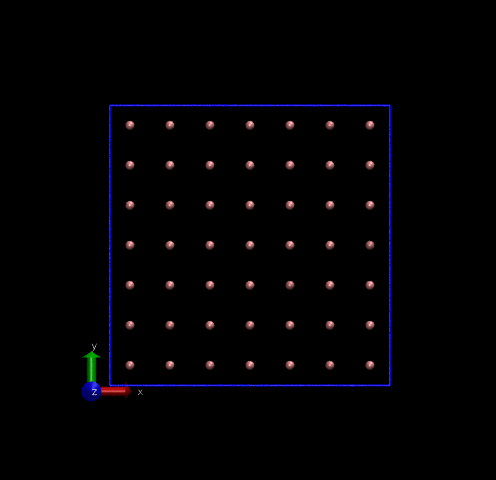
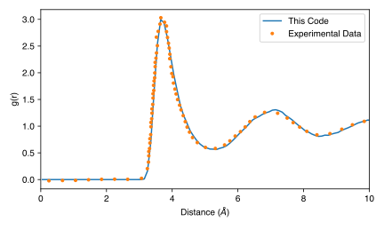
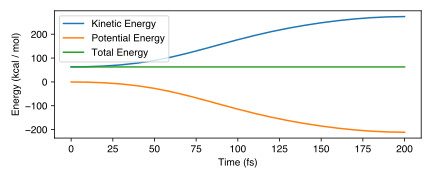
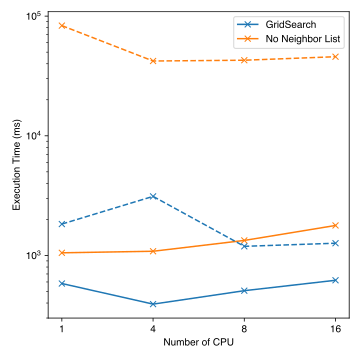
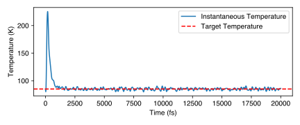

# Molecular Dynamic Simulator for Argon

**Author:** Zhe Liu <zhe.liu2 [at] wisc.edu>

A toy molecular dynamics engine specifically designed for Argon. Currently, it only supports Argon (maybe other noble gases as well) because neither Ewald Summation nor any constraint algorithms have been implemented.

## Compilation

```bash
g++ *.cpp -O3 -Wall -fopenmp -o main
```

## Usage

```bash
./main 6
```
This option takes 1~2 hours to finish. The parameter 6 is used for the final result. After data processing (`out.xyz`), you can visualize the NVT simulation result:



And compare it with the experiments [Phys. Rev. A 7, 2130](https://journals.aps.org/pra/abstract/10.1103/PhysRevA.7.2130)



Options 1-5 are also available. Refer to `test.cpp` for more details.

### Options 0 `void test_neighbor_list()`
The idea of a neighbor list is to only calculate force of the nearby molecules. This make sense because the Lennard-Jones potential decays in $-6$ order.

In this implementation, we use grid search method[^1][^3]. For a central molecule, in oder to find all molecules within a range $R_c$, we split all space into small grid, with a dimension of $R_c/2$, are only search 125 grids ($5^3$). 

> Although the prefactor is large, the scaling behavior makes the algorithm far superior over the standard $O(N^2)$ algorithm when there are more than a few hundred particles[^1]. 

In practice, only half of the 125 grids are searched since the interactions between atoms `i` and `j` have the same magnitude in opposite directions.

The debug information for the neighbor list of all atoms is available in `debug.log`.

### Options 1 `void test_neighbor_force()`
With the neighbor list, the calculated force should be nearly identical to the calculation without the neighbor list[^2].

Check `debug.log` and `debug2.log` for verification.

### Options 2 `void test_pbc()`
With the periodic boundary conditions (PBC), we assume a large system have many identical small part (unit cell), and we only need to simulate one unit cell. 

The previous two options has no PBC, where we are actually simulating several Argon atoms in the vacuum. With the PBC, we can simulate liquid or gas Argon.

Neighbor list searching is essential when PBC is enabled.
Otherwise there are infinite number atoms to consider.

### Options 3 `void benchmark_neighbor_freq_nopbc()`
Benchmark for neighbor list searching without PBC. The neighbor list is updated every few steps to balance computation time.

Typical results (number `n` in parentheses means searching is done every `n` steps):
| Method |No Neighbor List |  Grid (1000) | Grid (100) |  Grid (10) |
|:-----:|:---:|:---:|:---:|:---:|
|   Time (ms)   | 38041.9 | 4789.81 | 4855.47| 6039.52|

Refer to `debug*.out` for detailed logs. We should have a fixed total energy (energy conservation).



### Options 4 `void benchmark_neighbor_freq_pbcon()`
Similar benchmark but with the PBC.

### Options 5 `void test_omp()`
The current implementation doesn't scale well. I am not sure the exact reason.

Scaling is better for larger systems (dash line: 2048 atoms, solid line: 256 atoms). 16384 atoms scale more better than these two situations but still not very ideal.



### Options 6 `void NVT_result()`
The previous simulations had a fixed total energy (NVE, microcanonical ensemble), which is straightforward but not realistic. This option simulates a canonical ensemble with a fixed number of particles $N$, a fixed volume $V$ and a fixed temperature $T$.
The total energy is not fixed in the NVT simulation.

The Berendsen thermostat[^4] is used.
In `Trajectory.log`, you can find the instantaneous temperature of the system. With the thermostat, the system reaches the target temperature after around 3000 fs, where data collection for analysis can begin.




Reference:

[^1]: https://manual.gromacs.org/current/reference-manual/algorithms/molecular-dynamics.html#grid-search
[^2]: In pratice, just include all atoms in the neighbor list and never update the list
[^3]: https://docs.lammps.org/Developer_par_neigh.html
[^4]: https://en.wikipedia.org/wiki/Berendsen_thermostat
